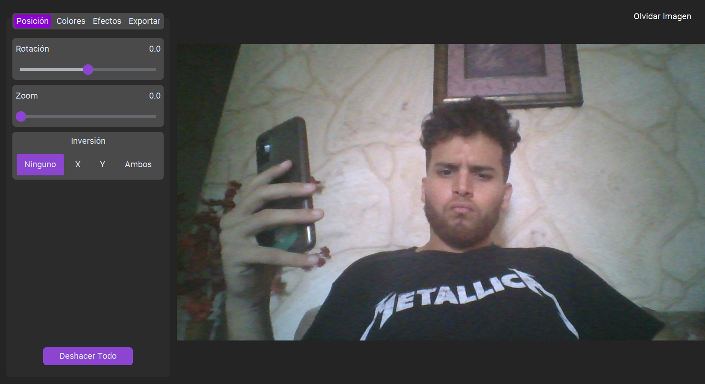
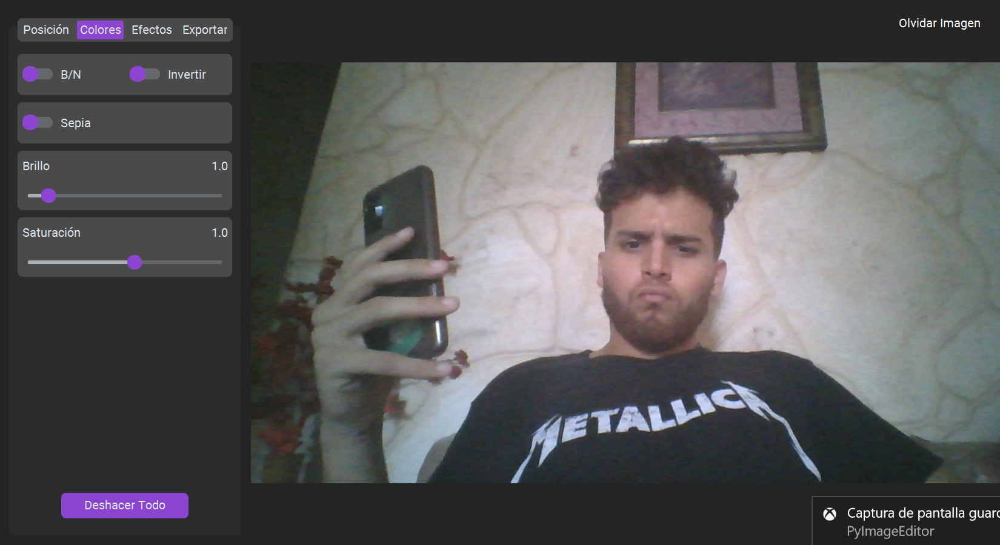
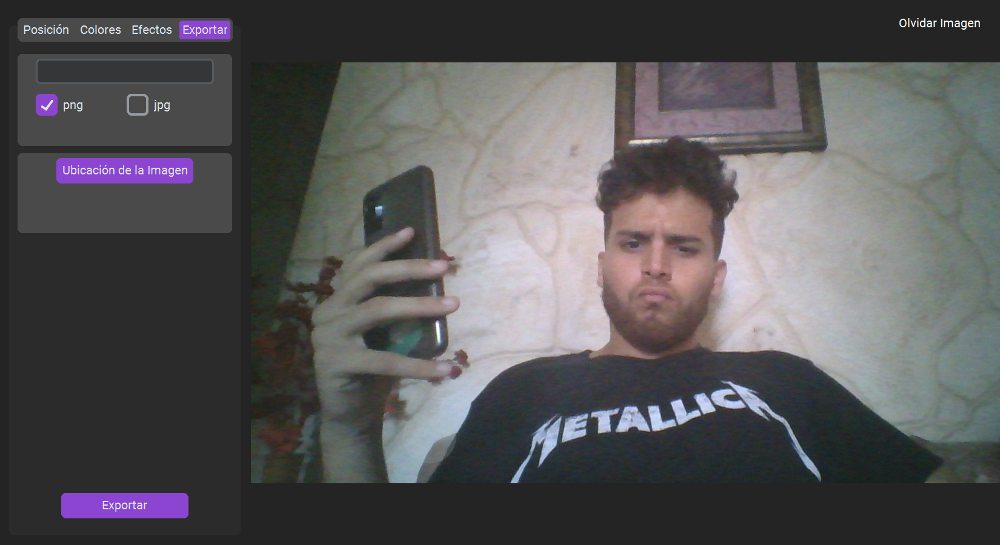

# PyImageEditor
Editor de imágenes en Python, usando CustomTkinter y PIL.

## 🔥 Funcionalidades
- **Posición**
  - Rotación
  - Zoom
  - Inversión de Posición
- **Colores**
  - Blanco y Negro
  - Inversión de Colores
  - Sepia
  - Brillo
  - Saturación
- **Efectos**
  - Selección de efectos variados
  - Gaussian Blur
  - Contraste
  - Nitidez
- **Exportación de la imagen**

## 📸 Capturas de Pantallas
### Pantalla Inicial
> 

### Pantalla de Posición
> 

### Pantalla de Colores
> 

### Pantalla de Efectos
> 

### Pantalla de Exportación
> 

## ✨ Descarga del ejecutable
Para descargar el ejecutable siga el [siguiente enlace](https://github.com/EduardoProfe666/PyImageEditor/releases/latest)